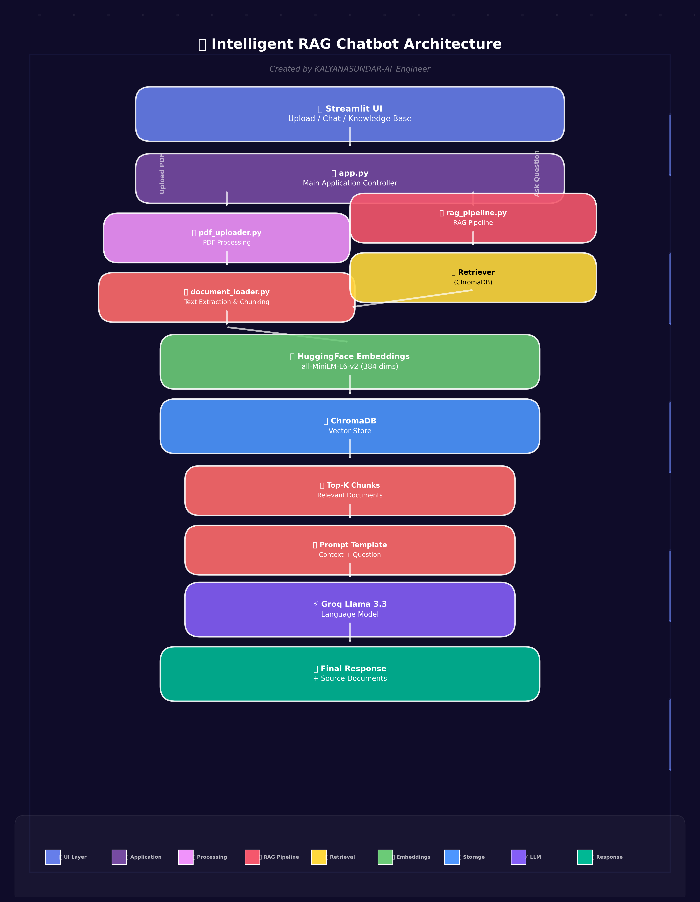

# 🤖 Intelligent RAG Chatbot using LangChain + Groq + ChromaDB

A Retrieval-Augmented Generation (RAG) chatbot that answers questions from PDF documents using LangChain, ChromaDB, HuggingFace Embeddings, and Groq Llama models.

---

# Features

- PDF Upload
- Dynamic Knowledge Base
- Duplicate PDF Detection
- SHA-256 File Hashing
- Metadata Management
- Chroma Vector Database
- HuggingFace Embeddings
- Groq Llama 3.3 LLM
- Source Document Citation
- Knowledge Base Manager
- Search Indexed Documents
- Delete Documents
- Re-index Documents
- Performance Testing
- Accuracy Evaluation
- Error Handling

---

# Tech Stack

| Component | Technology |
|-----------|------------|
| Language | Python 3.11 |
| UI | Streamlit |
| LLM | Groq Llama 3.3 |
| Framework | LangChain |
| Vector DB | ChromaDB |
| Embeddings | all-MiniLM-L6-v2 |
| PDF Loader | PyPDFLoader |
| Environment | dotenv |

---

# Project Structure

```text
RAG_Chatbot_Project/

app.py
rag_pipeline.py
vector_store.py
embeddings.py
document_loader.py
pdf_uploader.py
metadata_manager.py
document_manager.py
delete_vectors.py
reindex_document.py

config.py

data/
vector_db/
metadata/
reports/
assets/
```

---

# Installation

## Clone Repository

```bash
git clone https://github.com/yourusername/RAG_Chatbot_Project.git

cd RAG_Chatbot_Project
```

---

## Create Virtual Environment

```bash
python -m venv venv
```

Activate

Windows

```bash
venv\Scripts\activate
```

Linux

```bash
source venv/bin/activate
```

---

## Install Dependencies

```bash
pip install -r requirements.txt
```

---

## Configure API Key

Create

```
.env
```

Add

```env
GROQ_API_KEY=your_api_key
```

---

## Run

```bash
streamlit run app.py
```

---

# Usage

1. Upload PDF documents.

2. Documents are indexed into ChromaDB.

3. Ask questions.

4. Chatbot retrieves relevant chunks.

5. Groq generates answers.

6. Sources are displayed.

---

# Testing

Completed

- Functional Testing
- Performance Testing
- Accuracy Testing
- Robustness Testing

---

# Architecture



## Workflow

1. User uploads PDF documents through the Streamlit interface.
2. PDFs are loaded and split into text chunks.
3. Chunks are converted into vector embeddings using the HuggingFace all-MiniLM-L6-v2 model.
4. Embeddings are stored in ChromaDB.
5. When the user asks a question, the retriever finds the most relevant chunks.
6. The retrieved context and user question are combined using a prompt template.
7. Groq Llama 3.3 generates the final answer.
8. The chatbot displays the answer along with the source documents.

# Future Improvements

- Multi-user support
- OCR for scanned PDFs
- Hybrid Search (BM25 + Vector)
- Conversation Memory
- User Authentication
- Cloud Deployment

---

# License

MIT License

---


# Author

Kalyana Sundar
AI Engineer